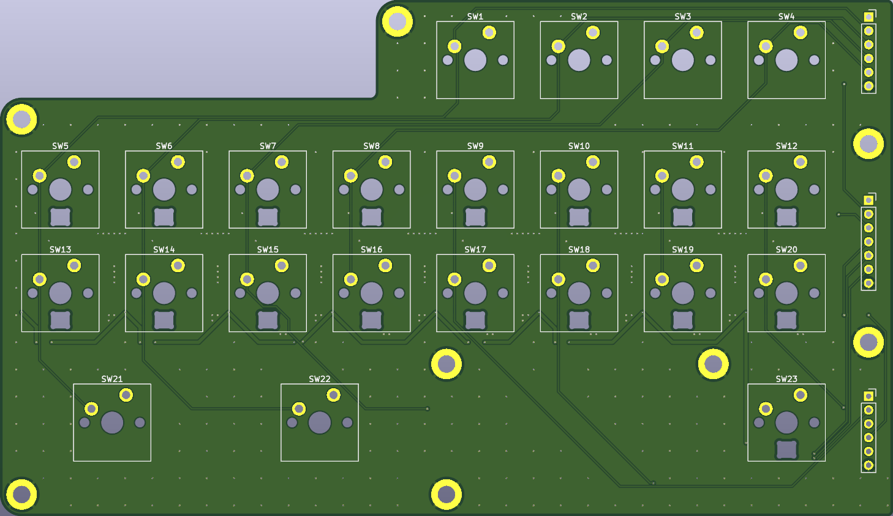
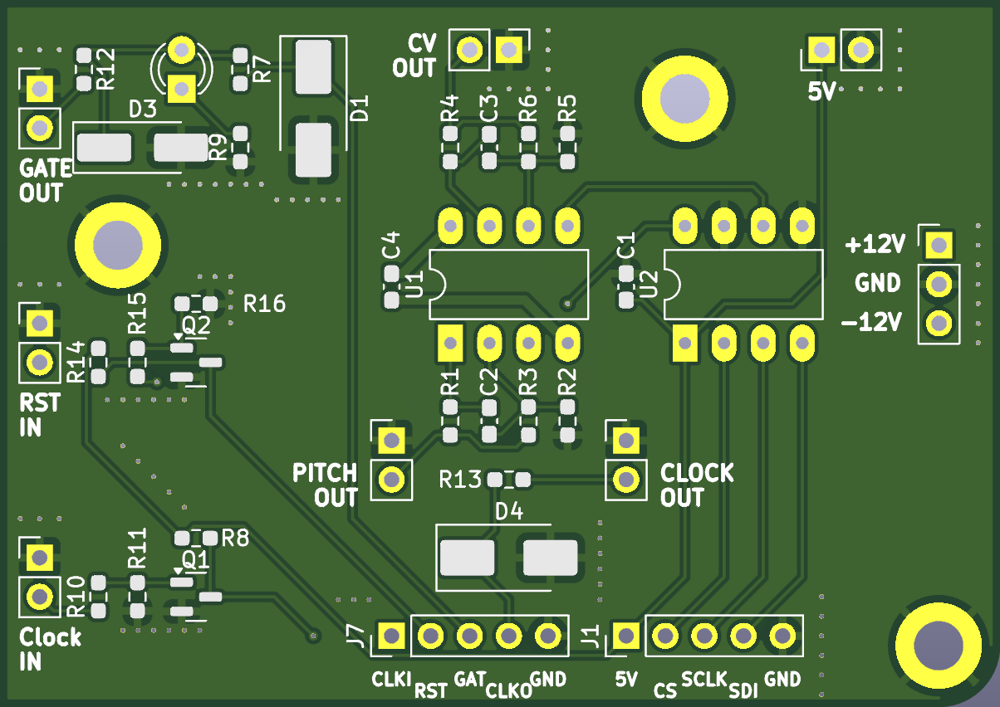

# Standalone Super Sixteen Sequencer

This repository contains a hardware project built in KiCad—a reimagined and streamlined version of the [Super Sixteen project](https://github.com/matthewcieplak/super-sixteen). The goal is to create a standalone sequencer suitable for Eurorack and other synthesizer setups.

## Project Overview

The original Super Sixteen design has been reworked into a modular, three-board system:
- **7 Segment Display Board:** Manages visual output.
- **DAC and Mono Jack Board:** Provides digital-to-analog conversion and audio interfacing.
- **16-Step Keyboard Board:** Features 16 Cherry MX switches paired with reverse-mount RGB LEDs for step sequencing.

> All pins are broken out for flexible connectivity. The boards are designed to work together or independently based on your setup.

## Key Modifications

- **Simplified Design:** Removed the IO expander from the original Super Sixteen to reduce complexity.
- **Modular Approach:** Each board can function as part of a larger system or as a standalone unit.
- **Fabrication Update:** The PCBs are currently in fabrication. This project is a work in progress (WIP).

## Getting Started

1. **Hardware Designs:** Navigate to the appropriate subfolder in the `hardware` directory to access the KiCad schematic and PCB layout files. There are four subfolders in here: three correspond to the three PCBs (i.e., the "keyboard", the DAC and IO board, the 3-digit 7-segment display driver). The fourth folder contains the keyboard layout files I generated with the [Keyboard Layout Editor](https://www.keyboard-layout-editor.com/), which I imported into Kicad with the excellent [kicad-kbplacer](https://github.com/adamws/kicad-kbplacer) plugin. You can use the JSON file provided in this folder to variate the switches' layout without having to go through the hassle of moving things around precisely on Kicad :).
2. **Software Development:** The `software` folder is currently empty. Firmware or control software will be added as the project develops.
3. **Documentation:** Detailed build instructions, assembly guides, and design notes will be provided in the `documentation` folder over time.

## Hardware Design
As mentioned above, ths repo contains three PCBs:

_The keyboard PCB, with 16 steps and seven function buttons, all using Cherry MX keyswitches_

_The DAC, opamp and IO board. I am using DIP packages for the two main ICs just because I had them laying around. The conversion to SMD packages is trivial - and there's plenty of space on the board!_

_The 7 segment driver pcb. I'm using a three-digit unit, 0.56" tall. Everything is driven by a 74HC595 to reduce the pins needed for interfacing with a microcontroller._

You will notice the glaring omission of a microcontroller from this setup. I am using the venerable Arduino MEGA as the brains of the operation, so that I have enough pins not to worry about faffing around with multiplexers and the like. 

## Inspiration

This project draws inspiration from the original [Super Sixteen project](https://github.com/matthewcieplak/super-sixteen). Visit their repository to learn more about the design and evolution of the sequencer.

## License

Code: GPL3.0 Hardware: cc-by-sa-3.0

## Contributing

Contributions, issues, and feature requests are welcome. Please feel free to open an issue or submit a pull request.
